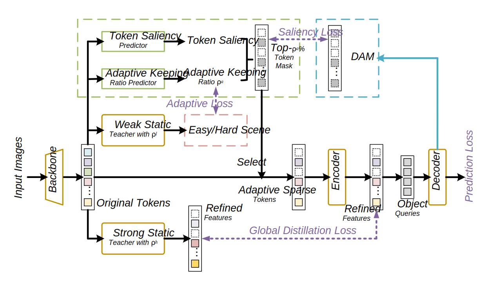

ATS-DETR
========

By [Muyao Yuan](https://scholar.google.com/citations?user=a4FVOnkAAAAJ)

* This repository is an official implementation of the paper [Adaptive token selection for efficient detection transformer with dual teacher supervision](https://doi.org/10.1016/j.knosys.2024.112036). 
* The code and some instructions are built upon the official [Sparse DETR repository](https://github.com/kakaobrain/sparse-detr) and [Deformable DETR repository](https://github.com/fundamentalvision/Deformable-DETR).


# Introduction

**TL; DR.** ATS-DETR introduces an adaptive token selection strategy for DETR-based models, dynamically adjusting the number of tokens based on input complexity to improve efficiency and accuracy.

<p align="center">

</p>

**Abstract.** Recently DEtection TRansformer(DETR)-based models obtain remarkable performance in object detection and various foundational vision tasks. However, its performance is impeded by high computational demands since it exhibits quadratic scaling with the number of feature tokens. To mitigate redundant computations in some areas like the background, existing works propose static token selection methods, which choose a predefined portion of tokens to forward. However, it is intuitive that the complexity of inference for detection tasks varies depending on the input images. Static token selection methods rely on a fixed keeping ratio, causing performance degradation in complex scenes and inefficiency in simple scenes. To address this issue, we propose an Adaptive Token Selection method for DETR (ATS-DETR) that dynamically chooses the token keeping ratio based on the complexity of the input to retain the most salient tokens. To explicitly control the sparsity and improve the performance of ATS-DETR, we put forward a novel approach called Dual Teacher Supervision to train the ATS-DETR. Specifically, we utilize a weak teacher to assist the model in distinguishing input complexity and a strong teacher for enhancing overall model performance through feature distillation. We further introduce the Global Distillation to minish the disparities of the feature patterns extracted from ATS-DETR and the strong teacher model. Extensive experiments demonstrate that ATS-DETR attains better performance compared to Deformable DETR while achieving an 83\% reduction of GFLOPs in the encoder, and outperforms all the static token selection methods.


# Installation

## Requirements

We have tested the code on the following environments: 
* Python 3.8.17 / Pytorch 1.8.0 / torchvision 0.9.0 / CUDA 11.1 / Ubuntu 20.04

Run the following command to install dependencies:
```bash
pip install -r requirements.txt
```

## Compiling CUDA operators
```bash
cd ./models/ops
sh ./make.sh
# unit test (should see all checking is True)
python test.py
```

# Usage

## Dataset preparation

Please download [COCO 2017 dataset](https://cocodataset.org/) and organize them as follows:

```
code_root/
└── data/
    └── coco/
        ├── train2017/
        ├── val2017/
        └── annotations/
        	├── instances_train2017.json
        	└── instances_val2017.json
```

## Training

### Training Teacher Model

For example, the command for training teacher model with the keeping ratio of 10% on 8 GPUs is as follows:

```bash
$ GPUS_PER_NODE=8 ./tools/run_dist_launch.sh 8 ./configs/r50_teacher_0.1.sh
```

### Training ATS-DETR

For example, the command to train ATS-DETR with a keeping ratio of 10% to 20% on 8 GPUs is as follows. Please note that the teacher's checkpoint should be placed in the same directory specified in the configuration:

```bash
$ GPUS_PER_NODE=8 ./tools/run_dist_launch.sh 8 ./configs/r50_ATS_DETR_0.1_0.2.sh
```

### Some tips to speed-up training
* If your file system is slow to read images, you may consider enabling '--cache_mode' option to load the whole dataset into memory at the beginning of training.
* You may increase the batch size to maximize the GPU utilization, according to GPU memory of yours, e.g., set '--batch_size 3' or '--batch_size 4'.

## Evaluation

You can get the pre-trained model of ATS-DETR (the link is in "Checkpoints" session), then run the following command to evaluate it on COCO 2017 validation set:

```bash
# Note that you should run the command with the corresponding configuration.
$ ./configs/r50_ATS_DETR_0.1_0.2.sh --resume <path to pre-trained model> --eval
```

You can also run distributed evaluation by using ```./tools/run_dist_launch.sh```.

# Checkpoints
The model checkpoints for **ATS-DETR** are available for download on Hugging Face at the following link: [MuyaoYuan/ATS-DETR](https://huggingface.co/MuyaoYuan/ATS-DETR/tree/main). 


# Citation
If you find ATS-DETR useful in your research, please consider citing:
```bibtex
@article{yuan2024adaptive,
  title={Adaptive token selection for efficient detection transformer with dual teacher supervision},
  author={Yuan, Muyao and Zhang, Weizhan and Yan, Caixia and Gong, Tieliang and Zhang, Yuanhong and Ying, Jiangyong},
  journal={Knowledge-Based Systems},
  volume={300},
  pages={112036},
  year={2024},
  publisher={Elsevier}
}
```

# License

This project is released under the [Apache 2.0 license](./LICENSE).
Copyright 2025 Muyao Yuan. All Rights Reserved.
